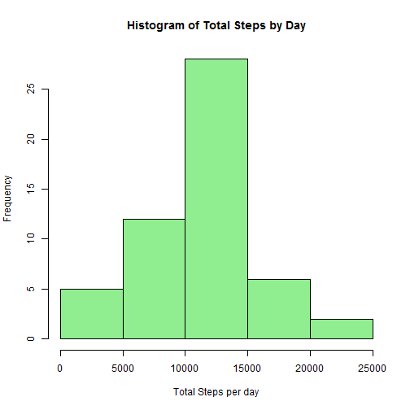
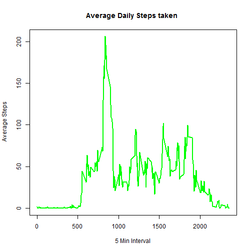
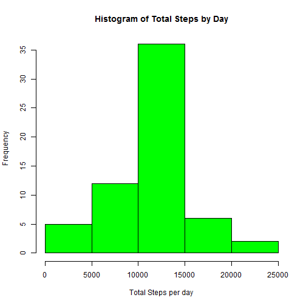
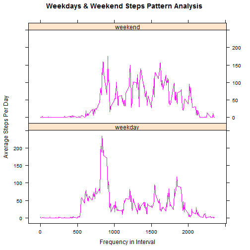

# Introduction 

It is now possible to collect a large amount of data about personal movement using activity monitoring devices such as a Fitbit, Nike Fuelband, or Jawbone Up. These type of devices are part of the "quantified self" movement -- a group of enthusiasts who take measurements about themselves regularly to improve their health, to find patterns in their behavior, or because they are tech geeks. But these data remain under-utilized both because the raw data are hard to obtain and there is a lack of statistical methods and software for processing and interpreting the data.

This assignment makes use of data from a personal activity monitoring device. This device collects data at 5 minute intervals through out the day. The data consists of two months of data from an anonymous individual collected during the months of October and November, 2012 and include the number of steps taken in 5 minute intervals each day.

## Data

The data for this assignment can be downloaded from the course web site:

Dataset: Activity monitoring data [52K]

The variables included in this dataset are:

 * steps: Number of steps taking in a 5-minute interval (missing values are coded as NA)

 * date: The date on which the measurement was taken in YYYY-MM-DD format

*  interval: Identifier for the 5-minute interval in which measurement was taken

The dataset is stored in a comma-separated-value (CSV) file and there are a total of 17,568 observations in this dataset.


### Loading and preprocessing the data

#### 1. Show any code that is needed to Load the data (i.e. read.csv())


```r
activity <- read.csv("activity.csv")
summary(activity)
```

```
##      steps                date          interval     
##  Min.   :  0.00   2012-10-01:  288   Min.   :   0.0  
##  1st Qu.:  0.00   2012-10-02:  288   1st Qu.: 588.8  
##  Median :  0.00   2012-10-03:  288   Median :1177.5  
##  Mean   : 37.38   2012-10-04:  288   Mean   :1177.5  
##  3rd Qu.: 12.00   2012-10-05:  288   3rd Qu.:1766.2  
##  Max.   :806.00   2012-10-06:  288   Max.   :2355.0  
##  NA's   :2304     (Other)   :15840
```

### 2. Process/transform the data (if necessary) into a format suitable for your analysis 
#### Ignore NA data set


```r
activityNotNA <- na.omit(activity)
## Convert factor to Date 
activityNotNA$date <- as.Date(activityNotNA$date)
##  Convert factor to Date & assign the date value to original data frame
activity$date <- as.Date(activity$date)
```


## What is mean total number of steps taken per day?

### 1. Calculate the total number of steps taken per day

```r
totalStepsbyDay <- aggregate(activityNotNA$steps, by=list(activityNotNA$date), FUN=sum)
## Change the column name to more readable 
names(totalStepsbyDay) <- c("Date", "TotalSteps")
```


### 2. Make a histogram of the total number of steps taken each day 

```r
hist(totalStepsbyDay$TotalSteps, main = "Histogram of Total Steps by Day", xlab = "Total Steps per day" , col ='Light Green')
```

 

### 3. Calculate and report the mean and median total number of steps taken per day


```r
mean(totalStepsbyDay$TotalSteps) 
```

```
## [1] 10766.19
```

```r
median(totalStepsbyDay$TotalSteps) 
```

```
## [1] 10765
```

## What is the average daily activity pattern?

### 1. Make a time series plot (i.e. type = "l") of the 5-minute interval (x-axis) and the average number of steps taken, averaged across all days (y-axis)


```r
totalStepsbyInterval <- aggregate(activityNotNA$steps, by=list(activityNotNA$interval), FUN=mean)
names(totalStepsbyInterval) <- c("Interval", "AverageStepsAllDays")

plot(totalStepsbyInterval, xlab ="5 Min Interval", ylab = " Average Steps", main="Average Daily Steps taken ", type = "l",lwd=2, col ='Green')
```

 

## 2. Which 5-minute interval, on average across all the days in the dataset, contains the maximum number of steps?


```r
max(totalStepsbyInterval$AverageStepsAllDays)
```

```
## [1] 206.1698
```

```r
intervalwithMaxStep <- totalStepsbyInterval[(totalStepsbyInterval$AverageStepsAllDays == max(totalStepsbyInterval$AverageStepsAllDays)), ]

intervalwithMaxStep
```

```
##     Interval AverageStepsAllDays
## 104      835            206.1698
```

## Imputing missing values

### 1. Calculate and report the total number of missing values in the dataset (i.e. the total number of rows with NAs)

```r
totalNA <- sum(is.na(activity$steps))
totalNA
```

```
## [1] 2304
```

### 2. Devise a strategy for filling in all of the missing values in the dataset. The strategy does not need to be sophisticated. For example, you could use the mean/median for that day, or the mean for that 5-minute interval, etc.
 *  Strategy - Fill NA with Mean of that day 5 mins interval

### 3. Create a new dataset that is equal to the original dataset but with the missing data filled in.

```r
averageSteps <- aggregate(steps ~ interval, data = activity, FUN = mean)
stepsfilledNA <- numeric()
for (i in 1 :nrow(activity)) {
    data <- activity[i, ]
    if (is.na(data$steps)) {
        steps <- subset(averageSteps, interval == data$interval)$steps
    } else {
          steps <-data$steps
    }
    stepsfilledNA <- c(stepsfilledNA, steps)
}

filledinActivity <- activity
filledinActivity$steps <- stepsfilledNA

totalNA <- sum(is.na(filledinActivity$steps))
totalNA
```

```
## [1] 0
```

### 4. Make a histogram of the total number of steps taken each day and Calculate and report the mean and median total number of steps taken per day. Do these values differ from the estimates from the first part of the assignment? What is the impact of imputing missing data on the estimates of the total daily number of steps?


```r
totalStepsbyDayFilled <- aggregate(filledinActivity$steps, by=list(filledinActivity$date), FUN=sum)
names(totalStepsbyDayFilled) <- c("Date", "TotalStepsFilled")

hist(totalStepsbyDayFilled$TotalStepsFilled, main = "Histogram of Total Steps by Day", xlab = "Total Steps per day" , col ='Green')
```

 

```r
##Before Imputing
mean(totalStepsbyDay$TotalSteps) 
```

```
## [1] 10766.19
```

```r
median(totalStepsbyDay$TotalSteps)
```

```
## [1] 10765
```

```r
##After Imputing
mean(totalStepsbyDayFilled$TotalStepsFilled)
```

```
## [1] 10766.19
```

```r
median(totalStepsbyDayFilled$TotalStepsFilled)
```

```
## [1] 10766.19
```

```r
## observation - Mean is same for before imputing but median is little bit different
```

## Are there differences in activity patterns between weekdays and weekends?
## For this part the weekdays() function may be of some help here. Use the dataset with the filled-in missing values for this part.

### 1. Create a new factor variable in the dataset with two levels - "weekday" and "weekend" indicating whether a given date is a weekday or weekend day.

```r
activityDay <- weekdays(activity$date)
activityDayType <- vector()

for (i in 1 :nrow(activity)) {
    if (activityDay[i] == "Sunday") {
        activityDayType[i] = "weekend"
    } else if (activityDay[i] == "Saturday") {
      activityDayType[i] = "weekend"
    } else {
      activityDayType[i] = "weekday"
    }
}


activity$activityDayType <- activityDayType
activity$activityDayType <- factor(activity$activityDayType)
```

### 2. Make a panel plot containing a time series plot (i.e. type = "l") of the 5-minute interval (x-axis) and the average number of steps taken, averaged across all weekday days or weekend days (y-axis). See the README file in the GitHub repository to see an example of what this plot should look like using simulated data.


```r
totalStepsbyDaybyDayType <- aggregate(steps ~ interval + activityDayType, data = activity, FUN=mean)

library(lattice)
xyplot(steps ~ interval | activityDayType,totalStepsbyDaybyDayType, layout= c(1, 2) , type ='l', main = "Weekdays & Weekend Steps Pattern Analysis", 
       ylab = "Average Steps Per Day" , xlab = "Frequency in Interval", col ="Magenta")
```

 

